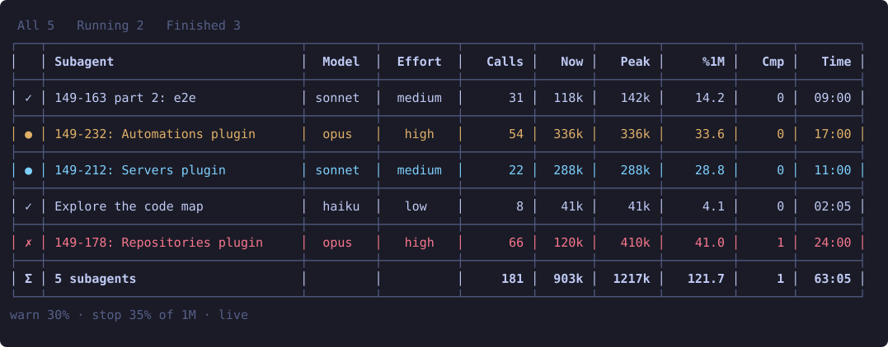

# divramod-subagent-context

A live pane of every subagent of the session: how much of its context window each one fills, with its model and
effort, so a subagent running out of room shows before it compacts.



## Install

```
claude plugin marketplace add divramod/divramod-claude-code-mods
claude plugin install divramod-subagent-context@divramod-claude-code-mods
```

See the [repository README](../../README.md) for the requirements.

## Open it

- A `subagents` button sits above the prompt: click it to open the pane, click again to close it. Its hotkey `s`
  works once that band has the keyboard (`ctrl+x tab` or a click on it).
- `/divramod-subagent-context` opens the pane too. Opened by the command or the button, the pane asks for the keyboard at once (it is granted while your prompt is empty); the pane that opens at the start of a session does not take it.

## The pane

The pane opens with the session. Reopen it any time with the command `/divramod-subagent-context`.

A table with a rule over and under it, between its rows and over a sum row. One row per subagent, filled while it
works (no polling), from the transcripts for subagents that ran before the mod loaded, and from the rows earlier
sessions left (see Remembered rows):

| Column | Meaning |
|---|---|
| (state) | `●` running, `✓` completed, `✗` failed or killed |
| Subagent | its description, `Plan 0149 row 232: Automations plugin` shortened to `149-232: Automations plugin` |
| Model, Effort | what it runs on (centered) |
| Calls | model responses so far (numbers are right-aligned) |
| Now, Peak | context in use now, and its highest so far |
| `%1M` / `%200k` | the peak as a share of the window |
| Cmp | compactions: its context fell below half of what it was |
| Time | `mm:ss` between its first and latest response |

The last row, `Σ`, adds up the shown rows: their count, calls, context, peaks, the share of the peaks and the time.

Colors: a running row is cyan; a row turns yellow from the warn share of its peak and red from the alert share or
after a compaction. A transcript over 4 MiB is not read: its counts show `-`.

Sort, resize and filter (in the terminal and desktop apps; VS Code and mobile show plain lines):

- **Sort**: click a header: ascending, descending, off.
- **Resize**: drag any column border, on the header or on any row, left or right. The table is never stretched, and never wider than the pane: the Subagent column gives way.
- **Filter**: click the tabs All, Running, Finished, or press `r` (running), `f` (finished), `h` / `l` or the left / right arrows (the tab before / after).
- **Rows**: `j` / `k` or the down / up arrows move a highlighted row; the pane's own keys (buttons under the table) work while the pane has the keyboard, the arrows once the table has it.

- **Close**: press `q` while the pane has the keyboard, or click `close` under the table (Esc hands the keyboard back to the prompt; `ctrl+x x` also closes).

The pane's top right shows the mod's version. The table is as tall as the pane, so it grows when you maximize the window and shrinks when you make it smaller again. It asks for a row per subagent (9 to 20 rows); rows that do not fit are counted in a last line (`… 3 more: make the pane taller`).

Sort, widths and filter stay while the pane redraws or is closed and reopened.

## Three tabs

The bar under the title switches the pane: **subagents** (`s`, this table), **plans** (`p`) and **agents** (`a`).
Plans lists the Claude Code sessions of this machine whose folder has a `plans/CURRENT_PLAN`, with the plan, the
session's name, its folder, its status and its age; Agents lists every live session the same way. `●` marks this
session. Both read `<config>/sessions/<pid>.json` (the files Claude Code keeps for each running session), check with `ps`
that the process still runs, and reload every 10 seconds while the module is loaded. A name is the session's own name,
else its folder's. Both tables are drawn like the subagents' table (sort by a header, drag the borders, `j` / `k` move a row, `q` closes) and follow the pane's size: when it is narrow the plan (or the agent) column gives way first.

## Remembered rows

A `/clear` starts a new session, so the rows would be gone. The mod writes them to
`~/.claude/divramod-subagent-context/rows-<folder>.json` (one file per working folder, so sessions in other folders never overwrite it) (`$CLAUDE_CONFIG_DIR` if set): at most 300 rows, none older than 14
days, at most every 5 seconds and at each subagent's end. A new session loads them first; a subagent that was still
running then shows as finished. Delete the file to forget them.

## Options

Set them when installing, or later in `/plugin` under the mod's configuration. Installing prints "3 userConfig options not yet set": the defaults below apply until you set them.

| Option | Default | Meaning |
|---|---|---|
| `window` | `auto` | The window a peak is counted against: `auto` takes the session's window, or `200k` / `1m`. Claude Code gives no window per subagent. |
| `warn_percent` | 30 | A row turns yellow from this share of the window. |
| `alert_percent` | 35 | A row turns red from this share of the window. |

## Develop

```
claude plugin validate --strict plugins/divramod-subagent-context
claude plugin test plugins/divramod-subagent-context
bun plugins/divramod-subagent-context/scripts/screenshot.ts   # regenerates docs/screenshot.svg
```

`scripts/screenshot.ts` draws the picture from fixture rows through the mod's own `hooks/table.ts`, so the picture
cannot drift from the pane.

## License

[MIT](../../LICENSE). Not affiliated with Anthropic.
